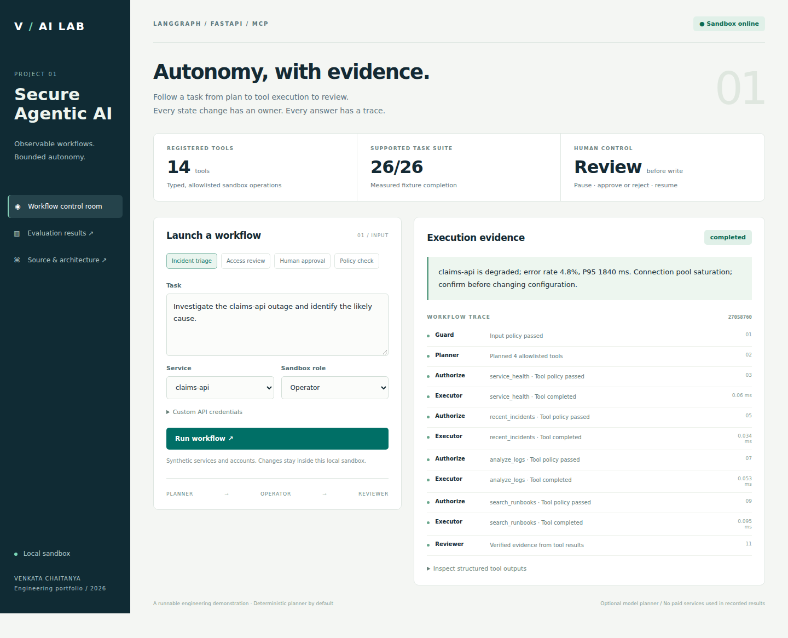
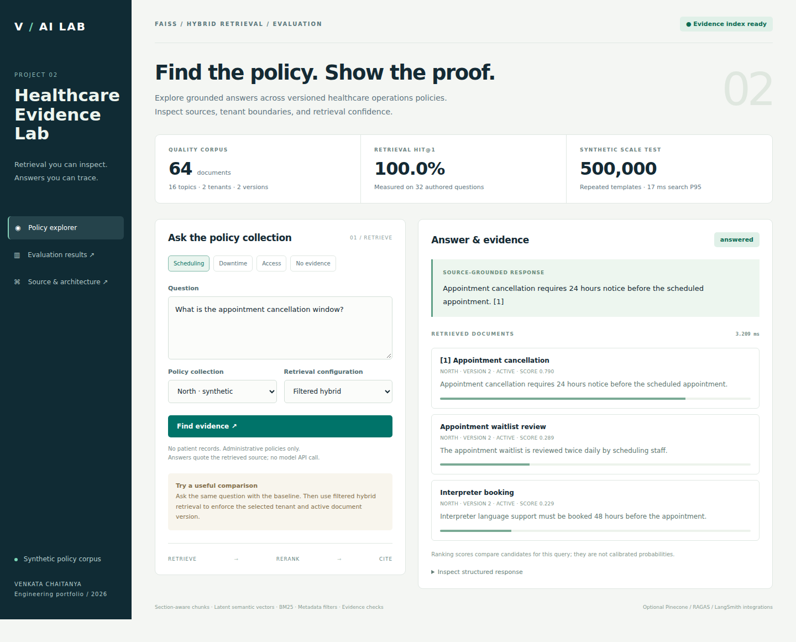

# VENKATA CHAITANYA · AI Engineering Portfolio

Two runnable projects focused on agent reliability, retrieval quality, and measurable evidence. Both include a browser demo, tests, evaluation fixtures, architecture notes, and recorded results. **Default demos run locally without API keys.**

| Project | What to inspect | Evidence |
|---|---|---|
| **[Secure Agentic AI Platform](secure-agentic-ai/)** | LangGraph workflows, 14 MCP tools, policy enforcement, human review, retries and traces | [Results](secure-agentic-ai/results/REPORT.md) · [Example trace](secure-agentic-ai/results/example_trace.json) |
| **[Healthcare RAG & Evaluation](healthcare-rag-evaluation/)** | FAISS + BM25, version/tenant filters, citations, retrieval ablations and optional cloud adapters | [Results](healthcare-rag-evaluation/results/REPORT.md) · [500K synthetic scale test](healthcare-rag-evaluation/results/scale.json) |

## 60-second tour

**An agent you can inspect.** Investigate an outage, inspect each tool result, and approve or reject a sandbox change.

[](secure-agentic-ai/)

**A retrieval system you can challenge.** Compare retrieval configurations and inspect the source version and tenant behind each answer.

[](healthcare-rag-evaluation/)

## Run the demos

Python 3.12 is the reference environment. Each project has its own dependency lock and can be copied into a separate repository without source-code changes.

```bash
git clone https://github.com/chaitanyakolicharamu/venkat_portfolio.git
cd venkat_portfolio/secure-agentic-ai
python -m venv .venv
source .venv/bin/activate
# Windows PowerShell: .venv\Scripts\Activate.ps1
python -m pip install -r requirements.lock
python -m pip install --no-deps -e .
python -m uvicorn agent_platform.api:app --host 127.0.0.1 --port 8001
```

Open **http://127.0.0.1:8001**. The [RAG quickstart](healthcare-rag-evaluation/#quickstart) uses port 8002. Alternatively, run both with `docker compose up --build` from this directory.

## How to read the numbers

These are newly built portfolio implementations, with **authored synthetic fixtures and directly measured local results**. They do not verify historical employer outcomes. The 500,000-record stress test repeats 64 synthetic policy templates; it is separate from the 64-document quality evaluation. No patient records or proprietary employer data are included. Optional cloud integrations are separated from the measured no-key path.

See [the recruiter walkthrough](RECRUITER_GUIDE.md) for a concise demo script and engineering discussion points.
