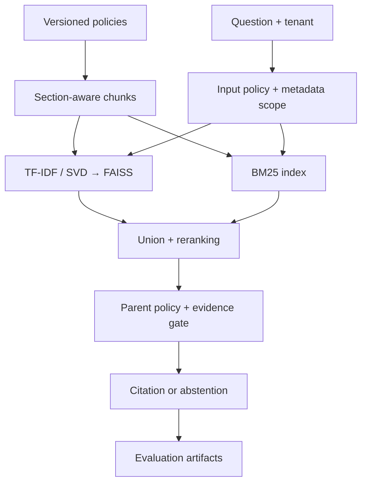

# Healthcare RAG & Evaluation

**FAISS · BM25 · Metadata filters · RAGAS adapters · LangSmith adapters**

Evidence-first retrieval for **synthetic healthcare operations policies**. The application distinguishes similar text from the correct active policy for the correct organization. Answers quote their source and expose document metadata.


**[Measured results](results/REPORT.md)** · **[500K scale run](results/scale.json)** · **[Example answer](results/example_answer.json)** · **[Recruiter tour](../RECRUITER_GUIDE.md)**

## Features

- **64 authored documents:** 16 administrative topics × 2 fictional organizations × 2 versions. No patient data or clinical advice.
- **192 section-aware chunks:** document, section, tenant, active-version and source identifiers.
- **Local embeddings:** normalized TF-IDF/truncated SVD vectors, fitted deterministically. These are not pretrained clinical embeddings.
- **FAISS + BM25:** candidate union and a transparent weighted reranker.
- **Filters before top-k:** tenant and active version enforced before candidate search in filtered modes.
- **Parent expansion:** retrieve a matching section, then cite the parent's actual policy rule.
- **Abstention and policy gates:** unsupported questions, example injection attempts, identifier-shaped input, and clinical requests.
- **Evaluation:** hit@1, recall@3, MRR, exact reference checks, citation-span support, safety/abstention checks, and warm latency.
- **Optional cloud adapters:** Pinecone, RAGAS judging, and LangSmith datasets/tracing.

## Quickstart

Run from this directory with Python 3.12:

```bash
python -m venv .venv
source .venv/bin/activate
# Windows PowerShell: .venv\Scripts\Activate.ps1
python -m pip install -r requirements.lock
python -m pip install --no-deps -e .
python -m uvicorn healthcare_rag.api:app --host 127.0.0.1 --port 8002
```

Open **http://127.0.0.1:8002**. API docs: **http://127.0.0.1:8002/docs**.

```bash
python -m pytest -q
python -m healthcare_rag.evaluate --output results
# Linux/macOS; use the container on Windows for process-memory reporting:
python -m healthcare_rag.scale --documents 500000 --queries 50 --output results/scale.json
```

The default generator is extractive: source text plus citation. It does not simulate paid LLM output or report LLM faithfulness scores.

## Architecture



## Retrieval ablations

| Configuration | Dense | Metadata filters | BM25 / reranking |
|---|---|---|---|
| `baseline` | Yes | No | No |
| `filtered_dense` | Yes | Tenant + active version | No |
| `hybrid` | Yes | Tenant + active version | Yes |

The unfiltered baseline intentionally leaves version/tenant ambiguity unresolved. Filtered dense isolates the metadata contribution. **The committed suite does not establish an accuracy advantage for hybrid over filtered dense.**

```bash
curl http://127.0.0.1:8002/api/ask \
  -H 'Content-Type: application/json' \
  -d '{"query":"What is the appointment cancellation window?","tenant":"north","strategy":"hybrid"}'
```

## Quality and scale are separate

Quality: **32 answerable questions, 6 unsupported questions, 8 safety examples**. The suite is authored alongside the corpus and is not held out. Reference checks test expected policy values. Substring support tests whether the answer came from its citation. Neither is clinical correctness.

Scale: **500,000 repeated synthetic records** derived from 64 templates, streamed into a separate 128-dimensional hashed-vector FAISS index. This measures build throughput, memory, and search latency. Hashing vectors differ from the quality pipeline's latent semantic vectors. It does not establish relevance across 500K unique documents, generation latency, concurrent load, or cloud performance. See [scale.json](results/scale.json).

All reported quality and latency metrics describe these reproducible local experiments and their stated scope.

## Optional integrations

Use a **separate virtual environment** for the adapters: versioned RAGAS uses a different LangChain dependency family from the agent project.

```bash
python -m pip install -r requirements-integrations.lock
python -m pip install --no-deps -e .
```

For RAGAS 0.3.7, set `OPENAI_API_KEY`, `RAGAS_JUDGE_MODEL`, and `RAGAS_EMBEDDING_MODEL` to available account models, then:

```bash
python -m healthcare_rag.integrations --dataset results/ragas_dataset.json --output runtime/ragas_scores.json
```

This explicit opt-in calls external providers and may incur cost. The adapter evaluates faithfulness, response relevance, context recall, and context precision. No external judge scores are included in the offline report.

LangSmith: configure credentials/tracing, then call `upload_langsmith_dataset(path, name)` or `trace_in_langsmith(question, tenant)` in [integrations.py](healthcare_rag/integrations.py).

Pinecone: create a cosine index with dimensions `retriever.vectors.shape[1]`, then use `PineconeAdapter(retriever, index_name).upsert()` and `.query(...)`. Keep the same fitted encoder for ingestion/query. Namespace separation and metadata filtering are included; application identity enforcement is not.

Optional paid/cloud paths were not exercised in the recorded runs.

## Boundaries

The tenant selector chooses a synthetic collection; it is not authorization. This is a local, unauthenticated API. Regex/thresholds are incomplete safeguards. The corpus is small and repetitive. Broader paraphrase testing, query clarification, pretrained embeddings, cross-encoders, durable ingestion, identity, PHI controls, and load testing remain production work.

References: [FAISS](https://github.com/facebookresearch/faiss/wiki) · [RAGAS 0.3.7](https://docs.ragas.io/en/v0.3.7/getstarted/rag_eval/) · [LangSmith](https://docs.langchain.com/langsmith/home) · [Pinecone SDK](https://docs.pinecone.io/reference/python-sdk).

MIT license. Policy rules and organizations are fictional fixtures.
