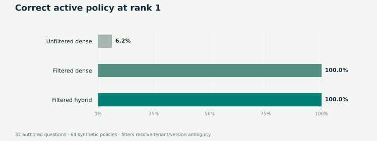

# Retrieval evaluation · recorded results

Generated: **2026-09-30T20:01:06.886843+00:00**. Run `python -m healthcare_rag.evaluate` to reproduce.

## Quality on the authored fixture suite

**64 documents / 192 chunks / 32 answerable questions / 6 unsupported questions / 8 safety examples.**

| Configuration | Hit@1 | Recall@3 | MRR@3 | Reference answer accuracy | Warm P95, ms |
|---|---:|---:|---:|---:|---:|
| Baseline | 6.25% | 53.12% | 0.271 | 6.25% | 1.542 |
| Filtered Dense | 100.00% | 100.00% | 1.000 | 100.00% | 1.586 |
| Hybrid | 100.00% | 100.00% | 1.000 | 100.00% | 1.746 |

Filtered hybrid passed **46/46** full case checks, including **8/8** safety cases and **6/6** unsupported-query abstentions.

The unfiltered baseline commonly retrieves an obsolete version or another tenant's policy. Metadata filtering accounts for the observed accuracy improvement. Filtered dense and hybrid tie on this suite; it does **not** demonstrate a reranking accuracy gain.

Citation-span support is 100%: generated extractive text appears in the cited policy. This is expected by construction and is not an LLM faithfulness or medical-accuracy score. Parent-document expansion supplies the operative rule even when an ownership section matched retrieval.

Per-query timing includes policy checks, query embedding, retrieval/reranking, parent expansion, and extractive formatting after index warmup. It excludes initial index construction, HTTP transport, model generation, cloud services, and concurrent load.

## Independent synthetic scale experiment

| Measurement | Observed result |
|---|---:|
| Records actually indexed | 500,000 |
| Distinct source templates | 64 |
| Hashing dimensions | 128 |
| Index build time | 4.550 s |
| Build throughput | 109,895.2 records/s |
| Warm search P50 | 15.289 ms |
| Warm search P95 | 17.005 ms |
| Vector storage | 244.14 MiB |
| Linux process peak RSS | 402.60 MiB |

50 timed queries follow 5 warmups on one FAISS thread. Scale uses repeated synthetic templates and 128-dimensional hashing, not the quality pipeline's SVD encoder. These timings include query hashing and vector search but exclude generation. No relevance claim is made for the 500K corpus.

## Inspect the evidence

- [Full quality outputs and individual case checks](benchmark.json)
- [Scale timing samples and environment](scale.json)
- [Example cited answer](example_answer.json)
- [RAGAS-format export](ragas_dataset.json) — exported input, not external judge scores
- [Fixtures](../healthcare_rag/data/eval_cases.json) and [corpus](../healthcare_rag/data/corpus.json)

Evaluation SHA-256: `2d38d5b2fae677e3e3db3656483ef1284381189e2649950c3077edc6e5826675`. Corpus SHA-256: `d04afac539a14211d5fab1d20d14f54534f7642f502ab196b396209e93f393a6`.

Python 3.12.14; FAISS 1.15.1; one FAISS thread. This authored, non-held-out suite is too small to estimate production quality. Paid RAGAS, LangSmith and Pinecone runs were not performed.
