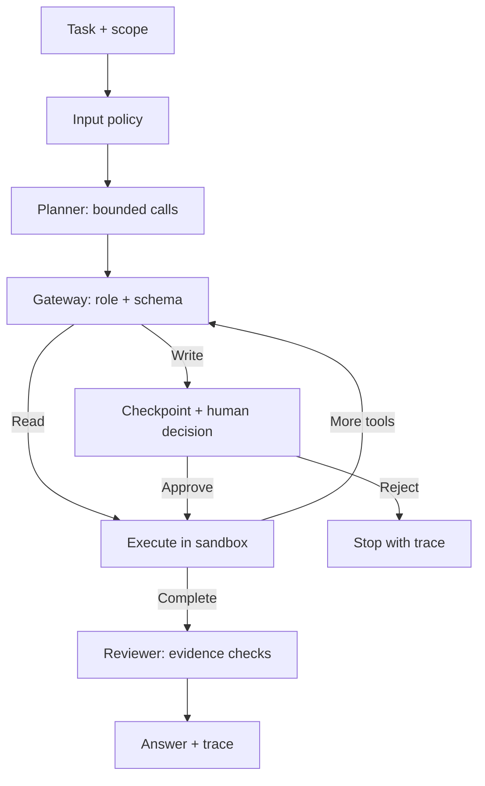

# Secure Agentic AI Platform

**LangGraph · FastAPI · MCP · Evaluation · Human review**

A runnable operations-agent sandbox that turns a task into a bounded plan, executes typed tools, and returns an evidence trail. Planner, operator, and reviewer responsibilities are explicit graph nodes. The default planner is deterministic; an optional model planner uses the same execution boundary.


**[Measured results](results/REPORT.md)** · **[Example trace](results/example_trace.json)** · **[Recruiter tour](../RECRUITER_GUIDE.md)** · **[Security boundary](SECURITY.md)**

## Features

- **14 tools:** health, incidents, runbooks, logs, SLA, assets, identity, access policy, patch compliance, costs, forecasts, rollback checks, sandbox tickets, and sandbox access revocation.
- **LangGraph checkpoints and interrupts:** pause before writes, then approve/reject and resume.
- **Gateway enforcement:** allowlists, argument validation, role and approval checks, idempotent writes.
- **Bounded recovery:** one retry for transient fixture timeouts; no arbitrary shell commands or URLs.
- **Official MCP SDK:** stdio discovery and calls. Raw clients have read-only privileges and cannot assert approval.
- **43 evaluation cases:** per-case evidence checks and a one-tool/no-retry architectural ablation.
- **Browser demo:** scenarios, role selection, human decisions, trace timeline, and structured outputs.

## Quickstart

Run from this directory with Python 3.12:

```bash
python -m venv .venv
source .venv/bin/activate
# Windows PowerShell: .venv\Scripts\Activate.ps1
python -m pip install -r requirements.lock
python -m pip install --no-deps -e .
python -m uvicorn agent_platform.api:app --host 127.0.0.1 --port 8001
```

Open **http://127.0.0.1:8001**. API docs: **http://127.0.0.1:8001/docs**.

```bash
python -m pytest -q
python -m agent_platform.evaluate --output results
```

The lockfile pins the tested dependencies. No model key or production service is needed.

## Architecture



The checkpointer and sandbox are in memory. Restarting clears runs and writes. A single-process lock serializes API mutations; storage is capped at 500 runs. This is a local reference design.

## API and credentials

```bash
curl http://127.0.0.1:8001/api/runs \
  -H 'Content-Type: application/json' -H 'X-API-Key: demo-operator' \
  -d '{"task":"Investigate the outage and create a ticket"}'

curl http://127.0.0.1:8001/api/runs/RUN_ID/review \
  -H 'Content-Type: application/json' -H 'X-Reviewer-Key: demo-reviewer' \
  -d '{"approved":true}'
```

Default credentials (`demo-operator`, `demo-viewer`, `demo-reviewer`) are public for this localhost demo. Override `OPERATOR_KEY`, `VIEWER_KEY`, and `REVIEWER_KEY` for credential experiments. They do not provide individual user authentication. `.env.example` is a reference; export variables or start uvicorn with `--env-file .env` to load them.

## MCP configuration

```json
{"mcpServers":{"secure-agentic-ai":{"command":"/absolute/path/to/.venv/bin/python","args":["-m","agent_platform.mcp_server"]}}}
```

Windows: use `Scripts/python.exe`. Install the package in that environment first. The integration test initializes a real server, lists all tools, invokes health, and verifies direct writes are denied.

## Optional model planner

Set `PLANNER_BASE_URL` to a chat-completions-compatible endpoint (for example, local Ollama), `PLANNER_MODEL`, and optionally `PLANNER_API_KEY`. Only explicit configuration enables this path. Plans are limited to six allowlisted calls and cannot change service/identity scope. Model errors stop the run. The benchmark never calls a model.

LangGraph can use the installed LangSmith integration with your own tracing configuration. Local trace JSON requires no cloud service. Do not enable external traces with sensitive data without appropriate controls.

## Measurement boundaries

The one-tool baseline intentionally cannot complete multi-tool tasks. It demonstrates workflow coverage, **not improvement over a competitive LLM agent**. The small authored suite is not held out. All metrics describe this implementation and its [committed fixtures](results/REPORT.md).

Production work would require durable checkpoints, per-user ownership, external reviewer identity, stronger injection defenses, rate/time limits, isolated execution, and adversarial model evaluation.

References: [LangGraph interrupts](https://docs.langchain.com/oss/python/langgraph/interrupts) · [Official MCP Python SDK](https://github.com/modelcontextprotocol/python-sdk).

MIT license. All accounts, services, logs, and amounts are synthetic.
