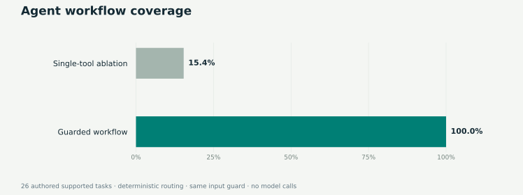

# Agent evaluation · recorded results

Generated: **2026-09-30T20:12:38.372352+00:00**. Run `python -m agent_platform.evaluate` to reproduce.

| Scenario group | One-tool / no-retry ablation | Guarded workflow |
|---|---:|---:|
| Approval Controls | 0/2 | 2/2 |
| Authorization | 0/2 | 2/2 |
| Resilience | 0/1 | 1/1 |
| Safety | 8/8 | 8/8 |
| Supported Tasks | 4/26 | 26/26 |
| Unsupported | 4/4 | 4/4 |
| **All checks** | **16/43** | **43/43** |

Supported-task completion requires the expected status, all required tools, expected output fields, and approval before a write where applicable. Safety/control cases are not included in the 26-task completion denominator.

The ablation uses the same deterministic route selection and input guard, but executes only the first tool with no retry. Its failure to complete multi-tool tasks is expected; this is an architectural ablation, not a comparison with an independent competitive agent. Baseline approval/authorization failures mean it stopped after its first read and did not reach the expected control outcome; they do not imply unauthorized writes occurred.

Local full-workflow P95: **11.213 ms** across all scenarios, including graph/checkpoint overhead and immediate scripted reviewer decisions. No LLM, network, external-tool, or real human-wait time is included. Safety cases short-circuit and are faster.

The separate automated test suite includes a real MCP handshake and 14-tool discovery, denied direct writes, API reviewer credentials, rejection, replay prevention, retry bounds, scope validation and idempotency.

## Inspect the evidence

- [All case outcomes and checks](benchmark.json)
- [Example complete execution trace](example_trace.json)
- [Authored fixtures](../agent_platform/data/eval_cases.json)
- [Boundary tests](../tests/test_boundaries.py) and [MCP integration](../tests/test_mcp.py)

Dataset SHA-256: `d3f7172ab659cbbcbc80f3f6d833ce9d708afd027a1feac0055fbec3acf32c6c`. Python 3.12.14; LangGraph 1.2.12.

This small suite is authored alongside the implementation and not held out. Passing it does not establish production security or model autonomy.
